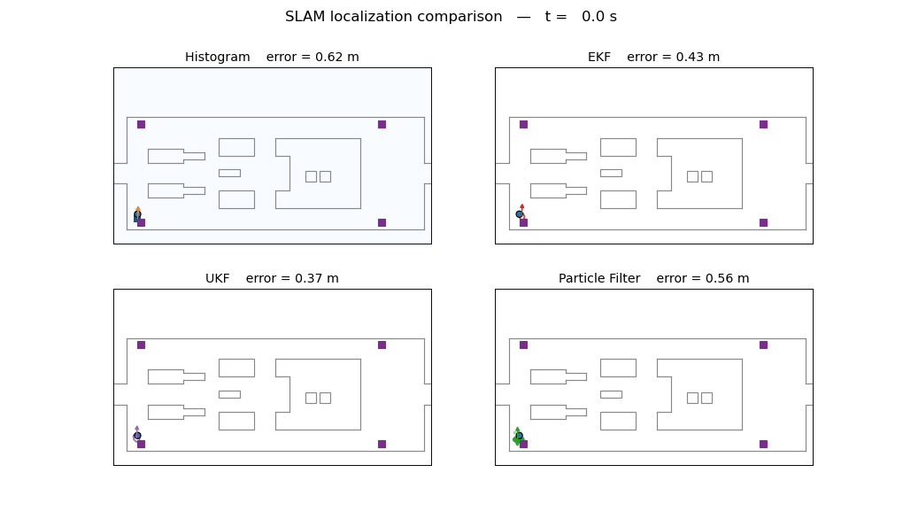
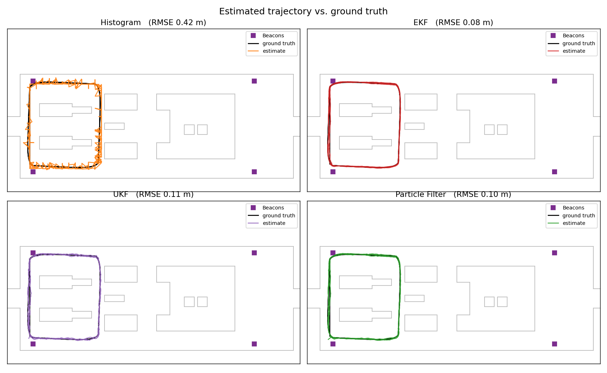
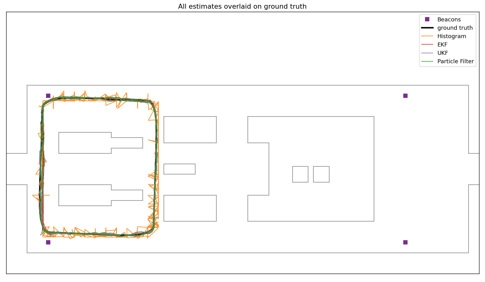
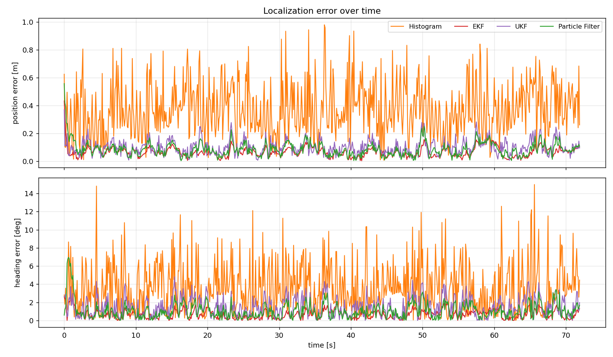
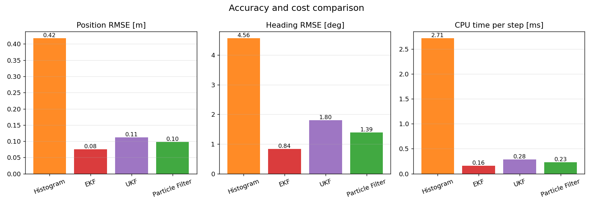

# Robot Localization for SLAM — Algorithm Comparison

A simulation that runs **four classic Bayesian localization algorithms** on the
**same** simulated robot, in the same map, with the **same noisy sensor data**,
and compares their accuracy and cost.

The robot drives an autonomous patrol loop through an office-like map. At every
time step it reports noisy **odometry** (linear/angular velocity), **range to
four known beacons** (UWB-style anchors), and a noisy **compass** heading. Each
filter must estimate the robot's pose `(x, y, θ)` from that data alone.

| Algorithm | Family | Belief representation |
|---|---|---|
| **Histogram filter** (grid Markov localization) | Non-parametric | Discrete probability grid over `(θ, x, y)` |
| **EKF** (Extended Kalman Filter) | Parametric | Single Gaussian, linearized with Jacobians |
| **UKF** (Unscented Kalman Filter) | Parametric | Single Gaussian, unscented transform (sigma points) |
| **Particle Filter** (Monte Carlo Localization) | Non-parametric | Weighted sample cloud |

These are the three paradigms from *Probabilistic Robotics* (Thrun, Burgard, Fox):
grid, Gaussian (EKF/UKF), and sample-based.

---

## Demo

All four filters tracking the robot simultaneously. Blue dot = true robot,
coloured arrow = each filter's estimate. Backgrounds show each filter's
**belief**: the histogram grid (blue), the EKF/UKF **covariance ellipse**, and
the particle cloud (green).



---

## Results

Position/heading error and CPU cost over a full run (`--steps 720`, `--seed 0`):

| Algorithm | Position RMSE [m] | Position mean [m] | Heading RMSE [deg] | CPU / step [ms] |
|---|--:|--:|--:|--:|
| Histogram       | 0.417 | 0.374 | 4.56 | 2.71 |
| EKF             | **0.075** | **0.066** | **0.84** | 0.16 |
| UKF             | 0.112 | 0.099 | 1.80 | 0.28 |
| Particle Filter | 0.098 | 0.084 | 1.39 | 0.23 |

*(Numbers vary slightly with `--seed`. Exact values are written to
`outputs/results.csv`.)*

**Takeaways**

- **EKF** is the most accurate and cheapest here — the beacon-range + compass
  model is only mildly non-linear and well represented by a single Gaussian.
- **UKF** and **Particle Filter** track almost as well; the PF is the most
  flexible (it can also represent multi-modal / global-localization beliefs).
- The **Histogram filter** is the least precise because its accuracy is capped
  by the grid resolution (1 m cells), and it is the most expensive because it
  updates the entire 3-D pose grid every step. Its strength is robustness and
  the ability to represent arbitrary beliefs without any Gaussian assumption.

### Generated plots

| | |
|---|---|
| **Per-filter trajectory vs. ground truth** | **All estimates overlaid** |
|  |  |
| **Error over time** | **Accuracy & cost bars** |
|  |  |

---

## How to run

### 1. Requirements

Python 3.9+ with the packages in [`requirements.txt`](requirements.txt):

```bash
pip install -r requirements.txt
```

(If you use Anaconda, the base environment already ships with everything except
possibly `pynput`, which is only needed for the optional interactive demo.)

### 2. Run the comparison

From the project root:

```bash
python run_comparison.py
```

This simulates the robot, runs all four filters on identical data, prints the
results table, and writes all plots **and** the animated GIF to `outputs/`.

Useful options:

```bash
python run_comparison.py --no-anim          # plots + metrics only (fast, ~2 s)
python run_comparison.py --steps 1000        # longer run / more laps
python run_comparison.py --seed 3            # different noise realization
python run_comparison.py --stride 3 --fps 20 # smoother / longer GIF
python run_comparison.py --outdir results    # write somewhere else
```

| Flag | Default | Meaning |
|---|---|---|
| `--steps`  | 720 | number of 0.1 s simulation steps |
| `--seed`   | 0   | RNG seed (controls the noise realization) |
| `--stride` | 4   | keep every Nth step as an animation frame |
| `--fps`    | 15  | GIF frame rate |
| `--no-anim`| off | skip the (slower) GIF rendering |
| `--outdir` | `outputs` | output directory |

### 3. (Optional) original interactive demo

`histogram.py` is the original keyboard-driven single-filter demo. Drive the
robot with the **arrow keys**, **space** to stop, **Esc** to quit. It needs
`pynput`:

```bash
pip install pynput
python histogram.py
```

---

## Project structure

```
SLAM_Project/
├── environment.py          # map, sensors, ground-truth robot, geometry (shared)
├── algorithms/
│   ├── base.py             # common filter interface
│   ├── histogram_filter.py # grid Markov localization
│   ├── ekf.py              # Extended Kalman Filter
│   ├── ukf.py              # Unscented Kalman Filter
│   └── particle_filter.py  # Monte Carlo Localization
├── run_comparison.py       # simulate -> run all filters -> metrics + plots + GIF
├── histogram.py            # original interactive single-filter demo
├── requirements.txt
└── outputs/                # generated plots, GIF and results.csv
```

---

## How it works

**Motion model (all filters).** A velocity model is integrated each step:

```
x'     = x + v·Δt·cos(θ)
y'     = y + v·Δt·sin(θ)
θ'     = θ + w·Δt
```

driven by the noisy odometry control `u = (v, w)`.

**Measurement model (all filters).** Every step the robot observes the range to
each of the four beacons, `rᵢ = ‖p − bᵢ‖`, plus an absolute compass heading.
Using the same measurement set for every algorithm keeps the comparison fair.

Each filter applies this differently:

- **EKF** — linearizes the motion and measurement models with Jacobians and
  propagates a Gaussian `N(μ, Σ)`.
- **UKF** — propagates `2n+1` sigma points through the exact non-linear models
  (no Jacobians); circular-mean handling is used for the heading dimension.
- **Particle Filter** — pushes ~600 particles through the noisy motion model,
  weights them by measurement likelihood, and resamples (systematic /
  low-variance) when the effective sample size drops below `N/2`.
- **Histogram** — represents the belief as a discrete grid over `(θ, x, y)`;
  the prediction step shifts + diffuses the grid, the correction step multiplies
  in the per-cell measurement likelihood.

**Fair start.** All filters are initialized from the *same* deliberately offset
initial guess with the same covariance, so the error plots show each one
converging from an identical starting belief.

---

## Extending

- Add a new algorithm by subclassing `BaseFilter` in `algorithms/` (implement
  `predict`, `update`, `estimate`) and adding it to `make_filters()` and `ORDER`
  in `run_comparison.py`.
- Change the map or beacon layout in `environment.py` (`_default_obstacles`,
  `Environment.beacons`).
- Tune sensor noise via the `*_STD` constants at the top of `environment.py`.
